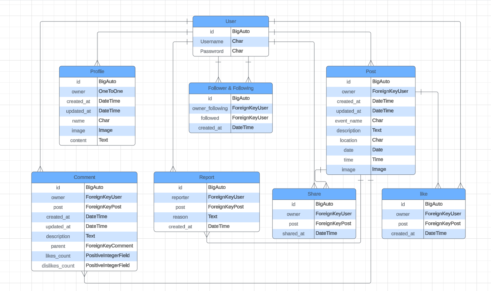
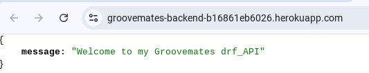
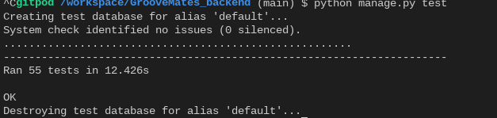
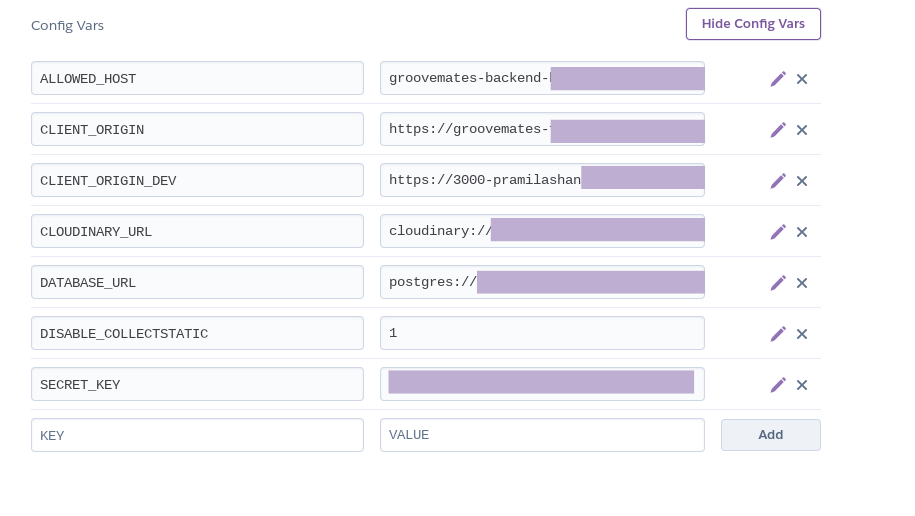

# Groovemates Backend API

**Advanced Front-End Portfolio Project(PP5) - Code Institute**

The *Groovemates_backend API* is the backend for the Groovmates application, built using Django Rest Framework. It serves as the foundation for a social network ([Groovmates](https://groovemates-frontend-b3335269700f.herokuapp.com/)) focused on sharing the musical events across to spread the words for all the music lovers. 

*Groovmates_backend API* is designed for users who want to create and join events, called "Post," which include a event, date, time, description, and location. Other users can show their interest by sharing, liking and commenting on the Posts. Each event is also open for comments and fostering communication. 

Additionally, users have the ability to follow others, allowing them to stay updated on Groovmates.
 
The API is organized into several key apps: 

_posts_: Manages the creation and details of events. 
_profiles_: Handles user profiles and related information. 
_shares_: To show interest on a post and also share them to make it more reachable. 
_comments_: Enables users to comment on Groovmatess. 
_likes_: Allows users to like a Post they are interested in. 
_reports_: Allows users to report a Post incase of irrelevant post. 
_followers_: Facilitates the following and tracking of other users' activities. 
 
This API is designed to be consumed by a React frontend, providing a seamless experience for users looking to connect and engage in activities together.
 
The deployed API can be found here: [Groovmates API](https://groovemates-backend-b16861eb6026.herokuapp.com/) 
The deployed React project can be found [here](https://groovemates-frontend-b3335269700f.herokuapp.com/) 
The link for the GitHub repository to the associated front end can be found [here](https://github.com/Pramilashanmugam/GrooveMates_backend)

## Table of Contents

- [User Experience](#user-experience)
- [Structure](#structure)
- [Database](#database)
  - [Models](#models)
- [API Endpoints](#api-endpoints)
- [Bugs](#bugs)
- [Technologies Used](#technologies-used)
  - [Languages](#languages)
  - [Tools](#tools)
  - [Frameworks](#frameworks)
  - [Libraries and modules](#libraries-and-modules)
- [Testing](#testing)
  - [Python Validator Testing](#python-validator-testing)
  - [Manual testing](#manual-testing)
  - [Automated Testing](#automated-testing)
  - [Browser Compatibility](#browser-compatibility)
- [Deployment](#deployment)
  - [Heroku](#heroku)
  - [Local deployment](#local-deployment)
  - [Forking this GitHub repository](#forking-this-github-repository)
  - [Clone this repository](#clone-this-repository)
  - [Cloudinary](#cloudinary)
  - [Create PostgreSQL using Code Institute Database Maker](#create-postgresql-using-code-institute-database-maker)
- [Credits](#credits)
  - [Code](#code)
  - [ReadMe](#readme)
  - [Acknowledgments](#acknowledgments)

## User Experience

I used an Agile methodology approach to plan this project. This was implemented through the GitHub Project board with epics, user stories and tasks.
Each user story was classified with a label according to MoSCoW prioritization. 
The Kanban board can be seen [here](https://github.com/users/Pramilashanmugam/projects/6). 

### Epics and User stories

Here we have a limited Epics and userstories, as more userstories and epics added during development in frontend More about the user stories can be found in the [Readme for the frontend part here.](https://github.com/users/Pramilashanmugam/projects/7)
 

List of Epics:  
- [Epic: Interaction with posts](https://github.com/Pramilashanmugam/GrooveMates_backend/milestone/3)
- [EPIC: Post Functionalities](https://github.com/Pramilashanmugam/GrooveMates_backend/milestone/2)
- [Epic: User Registration and Profile Management](https://github.com/Pramilashanmugam/GrooveMates_backend/milestone/1)

User Stories with their id:   
- As a developer, I need to create the base project set up so that I can build out the features. [#1](https://github.com/Pramilashanmugam/GrooveMates_backend/issues/1)
- As a user, I want to create an account with a unique username and password so that I can log in and manage my blog activities. [#2](https://github.com/Pramilashanmugam/GrooveMates_backend/issues/2)
- As a user, I want to create and update my profile with details like name, profile image, and bio to personalize my account. [#3](https://github.com/Pramilashanmugam/GrooveMates_backend/issues/3)
- As a user, I want to create a new post with details such as event name, description, location, date, time, and image, so I can share my experiences and information with others. [#4](https://github.com/Pramilashanmugam/GrooveMates_backend/issues/4)
- As a user, I want to edit or delete my posts to maintain control over the content I share. [#5](https://github.com/Pramilashanmugam/GrooveMates_backend/issues/5)
- As a user, I want to comment on posts to share my thoughts or ask questions about the content and also have CRUD functionality. [#6](https://github.com/Pramilashanmugam/GrooveMates_backend/issues/6)
- As a user, I want to like posts to show appreciation for the content shared by others. [#7](https://github.com/Pramilashanmugam/GrooveMates_backend/issues/7)
- As a user, I want to report posts or comments that violate community guidelines, so inappropriate content can be reviewed and addressed. [#8](https://github.com/Pramilashanmugam/GrooveMates_backend/issues/8)
- As a user, I want to share posts with other users, so I can highlight content I find interesting or useful. [#9](https://github.com/Pramilashanmugam/GrooveMates_backend/issues/9)
- As a developer, I want to create unit testing so that I can ensure the developed codes outcome meets the requirement. [#10](https://github.com/Pramilashanmugam/GrooveMates_backend/issues/10)
- As a user, I want to share a existing post so that i can show my interest on the post and also spreading the word about the event. [#11](https://github.com/Pramilashanmugam/GrooveMates_backend/issues/11)
- As a user, I want to see the count of followers, post and also the number of account i am following so that I can it gives me a clear picture on my visibility. [#12](https://github.com/Pramilashanmugam/GrooveMates_backend/issues/12)

## Structure

The first database schema was crafted during the planning phase of the project. The second one was created after finishing the project. It only adds two created_at fields and renames some of the tables. Both schemas were created with [dbdiagramm](https://dbdiagram.io/home). 

 
Final ERD: 
 

## Database 
I used a PostgreSQL provided by Code Institute as relational database. 

- **FieldTypes:** 
  - AutoField: An integer field that automatically increments.
  - CharField: A text field with a maximum length.
  - DateTimeField: A field for storing date and time.
  - DateField: A field for storing dates.
  - TimeField: A field for storing time.
  - TextField: A large text field.
  - ImageField: A field for uploading images, requires *upload_to* parameter to specify the directory where images will be uploaded.
  - OneToOneField: A one-to-one relationship.
  - ForeignKey: A many-to-one relationship.
  - IntegerField: An integer field.
 
- **Relationships:** 
  - A User has one Profile.
  - A Profile belongs to one User.
  - A Post is created by one User.
  - A User can create many posts.
  - A User can be a Share a post.
  - A User can like a Post.
  - A User can report many post.
  - A User can create a Comment for a Post. 
  - A Comment belongs to one User and one Post
  - A User can follow another User.

### Models

*Profile*  
- The Profile model represents a user's profile in the application, automatically created when a new user is registered. It includes various fields to store personal information such as the user's name, profile image, date of creation and updation,also description. The model also tracks when the profile was created and last updated. The associated *ProfileSerializer* is responsible for serializing the profile data, adding additional computed fields like whether the requesting user owns the profile (is_owner), and validating the profile image size and dimensions. The serializer also integrates follower-related information, such as follower counts and the ID of the current user's following relationship with the profile owner, to support social features in the application. 
 

*Posts*  
- The Posts model represents an event posted by a user within the application. Each posts includes details like the event name, image, the date and time it is scheduled to occur, the location, and a description and automatically tracks when the event was created and last updated. The associated *PostsSerializer* handles serialization of this data, adding additional fields to represent the ownership status, profile information of the post creator, likes, shared_by, report details, and counts of likes, comments, and shares. The serializer also ensures that the event's date is in the future and not greater than 10 years from current date and that any uploaded images meet specific size and dimension requirements. 

*Shares*  
- The Shares model represents a user who wants to share a existing post which he finds interesting, it will extract the post details and includes the users who have shared it." Each share is linked to both a user and a Posts, capturing the relationship between users and the post. The associated *ShareSerializer* is responsible for serializing the list of shared post, including details about the shared user and the event, and handles validation to preventing a user not to share same post more than once. The serializer raises an error if the user tries to share more than once.  

*Reports*  
- The Report model represents a user to raise his concern on a post if it is irrelevant. Report model includes fields like reporter, list of reasons, post, description and status. The report page is restricted only for admin use to avoid any misuse. The superuser can access all the reports and take necessary action.  

*Likes* 
- The likes model represents a user liking a specific Posts for showing his interest. Each like links a user to a Posts, recording when the likes was created. The model enforces that a user can only likes a Post once, ensuring no duplicates. The associated *likesSerializer* is responsible for handling the serialization of likes data, including the user and event details. It also includes validation logic to raise an error if a user attempts to likes the same event more than once. This structure supports a clean and efficient way to manage user likes within the application. 

*Comment* 
- The Comment model is designed to manage user-generated comments on specific Postss. Each comment is associated with a user (owner) and a Posts, capturing the content of the comment along with timestamps for when it was created and last updated. The model ensures that comments are displayed in reverse chronological order by default, showing the most recent ones first.
The associated *CommentSerializer* handles the serialization of comment data, including details about the user who made the comment, their profile picture, and the timestamps formatted in a human-readable manner. The CommentDetailSerializer extends this by providing additional details, such as the ID of the associated Posts event. This setup enables efficient management and display of comments within the application, fostering interaction and discussion around Posts events. 

*Follower* 
- The Follower model manages the relationships where users follow other users within the application. It establishes a connection between the owner (the user who is following) and the followed (the user being followed), allowing for tracking of these interactions. Each follow relationship is time-stamped, showing when it was created, and the model enforces uniqueness to prevent duplicate follow relationships. The data is ordered by the most recent followings by default.
The *FollowerSerializer* is responsible for converting these follow relationships into a serialized format for API responses. It includes fields for the usernames of both the follower and the followed, and it prevents users from following themselves or following the same user multiple times. This ensures the integrity of the following system within the application, supporting functionalities like displaying followers, following counts, and managing user connections.

*Home* 
A welcome message is displayed when you first enter the API site. 
 

## API Endpoints

The endpoints provided by the API are: 

| Endpoint                                     | HTTP Method | CRUD Operation |
| -------------------------------------------- | ----------- | -------------- |
| /dj-rest-auth/registration/                  | POST        | N/A            |
| /dj-rest-auth/login/                         | POST        | N/A            |
| /dj-rest-auth/logout/                        | POST        | N/A            |
| /profiles/                                   | GET         | Read           |
| /profiles/\\<int:pk\\>/                      | GET         | Read           |
|                                              | PUT         | Update         |
| /posts/                                      | GET         | Read           |
|                                              | POST        | Create         |
| /posts/\\<int:pk\\>/                         | GET         | Read           |
|                                              | PUT         | Update         |
|                                              | DELETE      | Delete         |
| /comments/                                   | GET         | Read           |
|                                              | POST        | Create         |
| /comments/\\<int:pk\\>                       | GET         | Read           |
|                                              | PUT         | Update         |
|                                              | DELETE      | Delete         |
| /shares/                                     | GET         | Read           |
|                                              | POST        | Create         |
| /shares/\\<int:pk\\>/                        | GET         | Read           |
|                                              | DELETE      | Delete         |
| /reports/                                    | GET         | Read           |
|                                              | POST        | Create         |
| reports/\\<int:pk\\>/(superusers/admin only) | GET         | Read           |
|                                              | PUT         | Update         |
|                                              | DELETE      | Delete         |
|                                              | POST        | Create         |
| likes                                        | GET         | Read           |
|                                              | POST        | Create         |
| /likes/\\<int:pk\\>/                         | GET         | Read           |
|                                              | DELETE      | Delete         |
|                                              |             |

## Bugs

## Technologies Used

### Languages:
- [Python](https://en.wikipedia.org/wiki/Python_(programming_language))

### Tools:
- [Git](https://git-scm.com/) was used for version control by utilizing the Gitpod terminal to commit to Git and Push to GitHub.
- [GitHub](https://github.com/) was used to save and store the files for the website.
- [GitHub Issues](https://docs.github.com/en/issues) have been used for Agile methodology by assigning user stories to issues and using labels to organize user stories.
- [GitHub Projects](https://docs.github.com/en/issues/planning-and-tracking-with-projects/learning-about-projects/about-projects) have been used for Agile sprint planning and task tracking.
- [Heroku](https://www.heroku.com) was used to deploy the application.
- [CI Gitpod](https://codeinstitute-ide.net/) was used as IDE. 
- [Code Insitute Database Maker](https://dbs.ci-dbs.net/) PostgreSQL database hosting for this project
- [Black Formatter](https://marketplace.visualstudio.com/items?itemName=ms-python.black-formatter) to beautify the code
- [LanguageTool](https://languagetool.org/) was used to check the grammar and spelling in the README and the Code. 
- [Pixelied](https://pixelied.com/convert/jpg-converter/jpg-to-webp) was used to convert jpg images into wepb images.
- [Tinypng](https://tinypng.com/) was used to compress the webp background-image.
- [Pixabay](https://www.pixabay.com/de-de/) was used to search and load the ghost for the logo.
- [Browserling](https://www.browserling.com/) was used to test the application on different browsers.
- [Cloudinary](https://cloudinary.com/) was used to store the item images.
- [Canva](https://www.canva.com/) was used to create the logo and the default image for a Groovemates.
- [Favicon.io](https://favicon.io/favicon-generator/) was used to create the favicon.
- [Google Chrome Dev Tools](https://developer.chrome.com/docs/devtools?hl=de) were used to check the application for responsiveness and errors.

### Frameworks:  
- [Django Rest Framework](https://www.django-rest-framework.org/)
- [Django](https://en.wikipedia.org/wiki/Django_(web_framework))

### Libraries and modules:
- [os](https://docs.python.org/3/library/os.html) provides functions to interact with the operating system. 
- [sys](https://docs.python.org/3/library/sys.html) was used to get system-specific functions.
- [datetime](https://docs.python.org/3/library/time.html) supplies classes for manipulating dates and times.
- [Gunicorn](https://gunicorn.org/) provides a way to serve Python web applications.
- [Pycopg 2](https://pypi.org/project/psycopg2/) is a PostgreSQL database adapter for Python.
- [sqlparse](https://pypi.org/project/sqlparse/): A non-validating SQL parser for Python.
- [dj_database_url](https://pypi.org/project/dj-database-url/) enables the ability to represent their database settings via a string.
- [django-cloudinary-storage](https://pypi.org/project/django-cloudinary-storage/): was used to connect Cloudinary as Django file storage
- [django-cors-headers](https://pypi.org/project/django-cors-headers/): Handle Cross-Origin Resource Sharing in Django
- [django-filter](https://pypi.org/project/django-filter/): Provides filtering with URL parameters for querysets
- [dj-rest-auth](https://dj-rest-auth.readthedocs.io/en/latest/): to handle user registration, login, and logout
- [djangorestframework-simplejwt](https://django-rest-framework-simplejwt.readthedocs.io/en/latest/getting_started.html): JSON Web Token authentication for Django REST Framework.
- [oauthlib](https://oauthlib.readthedocs.io/en/latest/): A generic, spec-compliant, thorough implementation of the OAuth request-signing logic.
- [PyJWT](https://pyjwt.readthedocs.io/en/stable/): JSON Web Token implementation in Python.
- [python3-openid](https://pypi.org/project/python3-openid/): A library for implementing OpenID in Python.
- [requests-oauthlib](https://pypi.org/project/requests-oauthlib/): OAuth library that implements the client side of the OAuth protocol.
- [dj-database-url](https://pypi.org/project/dj-database-url/): A simple utility to allow using Database URLs in Django.
- [whitenoise](https://whitenoise.readthedocs.io/en/latest/): A Django middleware to serve static files 
- [asgiref](https://github.com/django/asgiref): ASGI (Asynchronous Server Gateway Interface) reference library, used by Django for handling asynchronous web protocols
- [pillow](https://pypi.org/project/pillow/): A Python Imaging Library (PIL) fork, adding image processing capabilities to your Python applications.

## Testing

The app was tested regularly and deployed to Heroku to make sure both local and remote worked the same.

### Python Validator Testing

- All created python files were checked with the [Code Insitute validator - CI Python Linter](https://pep8ci.herokuapp.com/#).  

### Manual Testing

- *URL Path Verification*: Confirmed that all URL endpoints were correctly set up and functioning as expected, with no errors encountered during navigation. 
- *CRUD Operations Validation*: Conducted thorough testing of the create, read, update, and/or delete operations across various entities, including: posts, comments, shares, profiles, reports, followers, and likes.
  - Successfully created new entries and ensured the corresponding URLs were working properly.
  - Verified the update functionality, ensuring data could be correctly modified (with the exception of followers and likes).
  - Performed delete operations to confirm that posts and comments could be removed as intended.

These manual tests were conducted to ensure that the API operates smoothly and behaves as intended.

### Automated Testing
To cover all the user story scenarios, the following automated tests have been written into the Groovemates API.  

**Posts** 

PostListViewTest 
- test_can_list_posts: 
Confirms that logged-in users can retrieve a list of all posts. The server should return a 200 OK status. 

- test_logged_in_user_can_create_post: 
Ensures that a logged-in user can create a new post. Verifies that the post count increases, and the server returns a 201 CREATED status. 

- test_logged_out_user_cant_create_post: 
Ensures that logged-out users cannot create a post. The server should return a 403 FORBIDDEN status. 

PostDetailViewTest 
- test_can_retrieve_post_with_id: 
Ensures that a logged-in user can retrieve a post's details by its ID. The server returns a 200 OK status and the correct post data. 

- test_cant_retrieve_post_using_invalid_id: 
Validates that trying to retrieve a non-existent post (invalid ID) results in a 404 NOT FOUND status. 

- test_user_can_update_post: 
Verifies that a logged-in user can update their own post. Confirms the post's data is updated, and the server returns a 200 OK status. 

- test_user_cant_update_other_users_post: 
Ensures that users cannot update posts they do not own. Returns a 403 FORBIDDEN status. 

- test_user_can_delete_own_post: 
Confirms that users can delete their own posts. The post is removed, and the server returns a 204 NO CONTENT status. 

- test_user_cant_delete_other_users_post: 
Validates that users cannot delete posts owned by others. The server should return a 403 FORBIDDEN status. 

**Profiles** 

ProfileListViewTest 
- test_profile_is_created_automatically: 
Verifies that a Profile object is automatically created for each user when the user is created. The test checks that two profiles exist after two users are created. 

- test_list_profiles: 
Ensures that the API endpoint for listing profiles (/profiles/) returns a 200 OK status, confirming the endpoint is accessible and functioning as expected. 

ProfileDetailViewTests
- test_can_retrieve_profile_using_valid_id: 
Confirms that a profile can be retrieved using a valid profile ID. The server should return a 200 OK status. 

- test_cant_retrieve_profile_using_invalid_id: 
Verifies that attempting to retrieve a non-existent profile (invalid ID) returns a 404 NOT FOUND status. 

- test_logged_in_user_can_update_own_profile: 
Ensures that a logged-in user can update their own profile. The test validates that the profile's data is updated correctly, and the server responds with a 200 OK status. 

- test_user_cant_update_other_users_profile: 
Verifies that users cannot update profiles belonging to other users. The server should return a 403 FORBIDDEN status for unauthorized updates. 

**Comments** 

CommentListViewTest 
This class tests the API responsible for listing and creating comments:

- test_can_list_comments: 
Verifies that comments are listed successfully (status 200). A comment is created in the database, and a GET request to /comments/ ensures it is retrieved. 

- test_logged_in_user_can_create_comment: 
Tests if a logged-in user can create a comment. After logging in, a POST request to /comments/ is made. The test confirms the comment is added, and the API returns a status of 201 (Created). 

- test_logged_out_user_cant_create_comment: 
Ensures that unauthenticated users cannot create comments. A POST request by a logged-out user results in a 403 (Forbidden) status. 

CommentDetailViewTest 
This class tests the API for retrieving, updating, and deleting individual comments: 

- test_can_retrieve_comment_with_id: 
Verifies that a valid comment ID returns the comment details with a 200 status. 

- test_cant_retrieve_comment_using_invalid_id: 
Ensures that a request for a non-existent comment ID returns a 404 (Not Found) status. 

- test_user_can_update_comment: 
Confirms that a user can update their own comment. After logging in, a PUT request modifies the comment description, and the database reflects the changes (status 200). 

- test_user_cant_update_other_users_comment: 
Verifies that a user cannot edit another user's comment. A PUT request returns a 403 (Forbidden) status. 

- test_user_can_delete_own_comment: 
Confirms that users can delete their own comments. After logging in, a DELETE request successfully removes the comment (status 204, No Content). 

- test_user_cant_delete_other_users_comment: 
Ensures that users cannot delete comments owned by others. A DELETE request returns a 403 (Forbidden) status. 

**Followers** 

FollowerListViewTest 
This class tests the API for listing and creating follower relationships: 

- test_can_list_followers: 
Confirms that any user (authenticated or not) can retrieve a list of followers with a 200 OK status. 

- test_logged_in_user_can_follow_other_user: 
Verifies that a logged-in user can follow another user by making a POST request to /followers/. It checks that the follower count increases and returns a 201 CREATED status. 

- test_logged_out_user_cant_follow_other_user: 
Ensures that unauthenticated users cannot follow others. A POST request by a logged-out user results in a 403 FORBIDDEN status. 

- test_cant_follow_other_user_twice: 
Tests that duplicate follow relationships are prevented. A POST request to follow an already-followed user returns a 400 BAD REQUEST status. 

FollowerDetailViewTest 
This class tests the API for retrieving and deleting specific follower relationships: 

- test_can_retrieve_follower_with_id: 
Verifies that a valid follower relationship ID retrieves the correct details with a 200 OK status. 

- test_cant_retrieve_follower_using_invalid_id: 
Ensures that an invalid follower ID results in a 404 NOT FOUND error. 

- test_user_can_unfollow_other_user: 
Confirms that a logged-in user can unfollow another user by deleting the follower relationship with a 204 NO CONTENT status. 

- test_user_cant_delete_following_of_other_users: 
Verifies that users can only delete their own follower relationships. Trying to delete another user's follow relationship results in a 403 FORBIDDEN status. 

- test_user_cant_unfollow_other_user_if_not_logged_in: 
Ensures that an unauthenticated user cannot unfollow another user. A DELETE request in this scenario returns a 403 FORBIDDEN status. 

**Likes** 

- test_create_like_authenticated_user: 
Confirms that an authenticated user can like a post. The test verifies that a Like object is created and linked to the correct user, returning a 201 CREATED status. 

- test_create_like_unauthenticated_user: 
Ensures that unauthenticated users cannot like a post. The server responds with a 403 FORBIDDEN status. 

- test_retrieve_like_list: 
Verifies that the list of likes is accessible to any user (authenticated or not). The response should contain all likes, and the status code should be 200 OK. 

- test_retrieve_like_detail: 
Checks that details of a specific Like can be retrieved by its ID. Ensures the API returns the correct information with a 200 OK status. 

- test_delete_like_owner: 
Validates that the owner of a Like can delete it. After deletion, the Like no longer exists, and the server returns a 204 NO CONTENT status. 

- test_delete_like_non_owner: 
Ensures that users cannot delete likes they do not own. If attempted, the server returns a 403 FORBIDDEN status. 

- test_unique_constraint_on_like: 
Verifies that a user cannot like the same post more than once. A second like attempt for the same post returns a 400 BAD REQUEST status with a descriptive error message indicating a duplicate. 

**Reports** 

Create Reports 
- test_create_report_authenticated_user
Confirms an authenticated user can create a report with valid data. Ensures the report is successfully saved and includes the correct details. 

- test_create_report_unauthenticated_user 
Verifies that unauthenticated users are forbidden (403) from creating reports. 

List Reports 
- test_list_reports_admin_user
Confirms admin users can view the list of all reports and receive a 200 OK response. 

- test_list_reports_non_admin_user 
Ensures non-admin users cannot access the reports list, receiving a 403 FORBIDDEN response. 

Retrieve Report Details 
- test_retrieve_report_detail_admin_user 
Confirms that an admin user can retrieve the details of a specific report by its ID, ensuring data accuracy. 

Update Report Status 
- test_update_report_status_non_admin_user 
Verifies that non-admin users are forbidden (403) from updating the status of a report. 

Delete Reports 
- test_delete_report_admin_user 
Confirms that an admin user can delete a report and ensures the report count decreases appropriately. 

- test_delete_report_non_admin_user 
Ensures non-admin users cannot delete reports, receiving a 403 FORBIDDEN response. 

**Shares** 

Core Test Cases 

- test_list_shares 
Verifies the endpoint for listing all shares: 
Asserts the response is 200 OK.
Ensures the response data includes fields like id, user, and post. 
- test_create_duplicate_share 
Ensures a user cannot share the same post twice: 
Returns 400 BAD REQUEST.
Validates that a proper error message is included. 
- test_list_shared_posts 
Verifies listing posts shared by the authenticated user: 
Asserts the response is 200 OK.
Confirms the returned posts match the expected shared post count and details. 
- test_list_shared_posts_by_profile_id 
Validates listing shared posts using a specific profile_id: 
Asserts the response is 200 OK.
Confirms the returned posts align with the profile's shares. 

Access Control 
- test_unauthenticated_user_access 
Ensures unauthenticated users cannot create shares: 
Returns 403 FORBIDDEN.
Validates no new share is created in the database.

Edge Cases 
- test_create_share_with_invalid_post_id 
Validates creating a share with an invalid post ID: 
Asserts 400 BAD REQUEST. 
- test_list_shared_posts_empty 
Ensures the endpoint correctly handles the absence of shared posts: 
Returns 200 OK.
Confirms the result is an empty list. 

Screenshot of final test: 
 

### Browser Compatibility
  The tests were conducted using the following browser:

- Google Chrome Version 127.0.6533.120 

## Deployment

### Heroku
This site is deployed using Heroku. To deploy it from its GitHub repository to Heroku, I took the following steps:

1. Create a list of requirements in the requirements.txt file by using the command _pip3 freeze > requirements.txt_
2. Log in (or sign up) to Heroku
3. Click on the _New_ button and select _Create new app_
4. Give it a unique name and choose the region _Europe_
5. Click the *Settings* tab, go to the _Config Vars_ section and click on the _Reveal Config Vars_ button
6. Add all variables from *env.py* to _ConfigVars_ of Heroku
 
7. Click the _Add_ button
8. Click the *Deploy* tab, go to the _Deployment method_ section, select _GitHub_ and confirm this selection by clicking on the _Connect to Github_ button
9. Search for the repository name on github _GrooveMates_backend_ and click the _Connect_ button
10. Add in the setting.py the Heroku app URL into ALLOWED HOSTS 
11. Gather all static files of the project by using the command _python3 manage.py collectstatic_ in the terminal
12. Make sure that DEBUG=FALSE in settings.py
13. Create a _Procfile_ in the root directory and add *web: gunicorn fv_api.wsgi*
13. In Heroku enable the automatic deploy or manually deploy the code from the main branch

To see the [view of the live site](https://groovemates-backend-b16861eb6026.herokuapp.com/) click on the _Open app_ button in the top right corner or, if you enabled automatic deploy (step 13), log in to GitHub, navigate to the repository for this project by selecting [*Pramilashanmugam/GrooveMates_backend*](https://github.com/Pramilashanmugam/GrooveMates_backend), click on the _Deployments_ heading and choose in the _Environments_ section GrooveMates_backend. On top of the latest deployment is the link to the [live site](https://groovemates-backend-b16861eb6026.herokuapp.com/). 

### Local deployment

1. Generate an env.py file in the root directory of the project
2. Configure the environment variables within this file.
3. Create a virtual environment, if neccessary
4. Install all required dependencies using _pip install_ command (into the .venv)
5. Add dependencies to the requirements.txt file using _pip3 freeze > requirements.txt_ command

### Forking this GitHub repository
1.  Log in to GitHub.
2.  Navigate to the repository for this project by selecting [*Pramilashanmugam/GrooveMates_backend*](https://github.com/Pramilashanmugam/GrooveMates_backend)
3. Click at the top of the repository on the **Fork** button on the right side

### Clone this repository
1. Log in to GitHub.
2. Navigate to the repository for this project by selecting [*Pramilashanmugam/GrooveMates_backend*](https://github.com/Pramilashanmugam/GrooveMates_backend)
3. In the top-right corner, click on the green *Code* button
4. Copy the HTTPS URL in the tab *Local*
5. Go to the code editor of your choice and open the terminal
5. Type `git clone` and paste the URL you copied into your terminal
6. Press the enter key

### Cloudinary
1. Navigate to [Cloudinary](https://cloudinary.com/)
2. Sign up or log in to account
3. Go to the dashboard
4. Click on _Go to API Keys_ button
5. Generate a new API Key
6. Provide the API environment variable in format: *CLOUDINARY_URL=cloudinary://<your_api_key>:<your_api_secret>@dwqek0e9x* in _env.py_ and _Config Vars_
7. Update settings.py

### Create PostgreSQL using Code Institute Database Maker
1. As Student of the Code Institute, navigate to the [CI Database Maker](https://dbs.ci-dbs.net/)
2. Input your email address
3. Paste the provided URL in as your DATABASE_URL value

## Credits

### Code
- The initial setup and overall architecture of this project were guided by the Code Institute's Django Rest Framework walkthrough project. The core elements of the Profile, Post, Follower, likes and Comment models, along with their respective serializers, filtering capabilities, and tests, were derived from the walkthrough project and subsequently tailored to meet the unique requirements of this project.
- A great help and inspiration were the advanced frontend projects by [Fsjavier](https://github.com/fsjavier/hoodsap-api/tree/main/reports), [Gareth-McGirr](https://github.com/Gareth-McGirr/body-doodles-api), [Johannes Bernet](https://github.com/nacht-falter/sonic-explorers-api), and [Shubham Sinha](https://github.com/Sinha5714/pp5-api-ref/tree/main/pp5_api)

- The following websites were used as a source of knowledge:  
  - [Google](www.google.com)
  - [mdn](https://developer.mozilla.org/en-US/)
  - [W3C](https://www.w3.org/)
  - [W3schools](https://www.w3schools.com/)
  - [DevDocs](https://devdocs.io/)
  - [Stack Overflow](https://stackoverflow.com/)
  - [reddit](https://www.reddit.com/)
  - [forum djangoproject](https://forum.djangoproject.com/)
  - Documentation for [Django](https://www.djangoproject.com/), [Django Rest Framework]((https://www.django-rest-framework.org/)), [Cloudinary](https://cloudinary.com/documentation)
  - Slack Community
  - For troubleshooting, [Google](www.google.com), [Phind](https://www.phind.com/search?home=true), and [ChatGPT](https://chatgpt.com/) were used, too. Especially since the walkthrough project is completely outdated and many of the components no longer work as they should.

  ### ReadMe

- One last time, a big thank you to [Queenisabaer/Dajana](https://github.com/queenisabaer/friendventure-api/) and all of her tips on what makes a good README.

### Acknowledgements

- I would like to thank my wonderful mentor Gareth McGirr for his numerous tips and great assistance during the creation of this project.  
- A big thank you to [Dennis Schenkel](https://github.com/DennisSchenkel) for all his help on this project, especially for assisting me by reviewing my project. 
- Furthermore, I would like to give a shoutout to the wonderful tutor team who helped me numerous times when I was stuck and struggling to achieve the results I was aiming for. Your support and guidance have been amazing. Thank you!

**This is for educational use.**