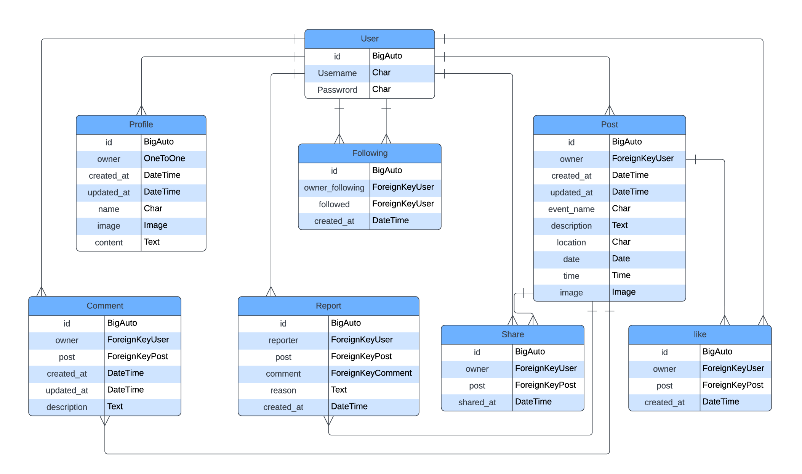

# Groovemates Backend API

**Advanced Front-End Portfolio Project(PP5) - Code Institute**

The *Groovemates_backend API* is the backend for the Groovmates application, built using Django Rest Framework. It serves as the foundation for a social network ([Groovmates](https://groovemates-frontend-b3335269700f.herokuapp.com/)) focused on sharing the musical events across to spread the words for all the music lovers. 

*Groovmates_backend API* is designed for users who want to create and join events, called "Post," which include a event, date, time, description, and location. Other users can show their interest by sharing, liking and commenting on the Posts. Each event is also open for comments and fostering communication. 

Additionally, users have the ability to follow others, allowing them to stay updated on Groovmates.
 
The API is organized into several key apps: 

_posts_: Manages the creation and details of events. 
_profiles_: Handles user profiles and related information. 
_shares_: To show interest on a post and also share them to make it more reachable. 
_comments_: Enables users to comment on Groovmatess. 
_likes_: Allows users to like a Post they are interested in. 
_reports_: Allows users to report a Post incase of irrelevant post. 
_followers_: Facilitates the following and tracking of other users' activities. 
 
This API is designed to be consumed by a React frontend, providing a seamless experience for users looking to connect and engage in activities together.
 
The deployed API can be found here: [Groovmates API](https://groovemates-backend-b16861eb6026.herokuapp.com/) 
The deployed React project can be found [here](https://groovemates-frontend-b3335269700f.herokuapp.com/) 
The link for the GitHub repository to the associated front end can be found [here](https://github.com/Pramilashanmugam/GrooveMates_backend)

## Table of Contents

- [User Experience](#user-experience)
- [Structure](#structure)
- [Database](#database)
  - [Models](#models)
- [API Endpoints](#api-endpoints)
- [Bugs](#bugs)
- [Technologies Used](#technologies-used)
  - [Languages](#languages)
  - [Tools](#tools)
  - [Frameworks](#frameworks)
  - [Libraries and modules](#libraries-and-modules)
- [Testing](#testing)
  - [Python Validator Testing](#python-validator-testing)
  - [Manual testing](#manual-testing)
  - [Automated Testing](#automated-testing)
  - [Browser Compatibility](#browser-compatibility)
- [Deployment](#deployment)
  - [Heroku](#heroku)
  - [Local deployment](#local-deployment)
  - [Forking this GitHub repository](#forking-this-github-repository)
  - [Clone this repository](#clone-this-repository)
  - [Cloudinary](#cloudinary)
  - [Create PostgreSQL using Code Institute Database Maker](#create-postgresql-using-code-institute-database-maker)
- [Credits](#credits)
  - [Code](#code)
  - [ReadMe](#readme)
  - [Acknowledgments](#acknowledgments)

## User Experience

I used an Agile methodology approach to plan this project. This was implemented through the GitHub Project board with epics, user stories and tasks.
Each user story was classified with a label according to MoSCoW prioritization. 
The Kanban board can be seen [here](https://github.com/users/Pramilashanmugam/projects/6). 

### Epics and User stories

Here we have a limited Epics and userstories, as more userstories and epics added during development in frontend More about the user stories can be found in the [Readme for the frontend part here.](https://github.com/users/Pramilashanmugam/projects/7)
 

List of Epics:  
- [Epic: Interaction with posts](https://github.com/Pramilashanmugam/GrooveMates_backend/milestone/3)
- [EPIC: Post Functionalities](https://github.com/Pramilashanmugam/GrooveMates_backend/milestone/2)
- [Epic: User Registration and Profile Management](https://github.com/Pramilashanmugam/GrooveMates_backend/milestone/1)

User Stories with their id:   
- As a developer, I need to create the base project set up so that I can build out the features. [#1](https://github.com/Pramilashanmugam/GrooveMates_backend/issues/1)
- As a user, I want to create an account with a unique username and password so that I can log in and manage my blog activities. [#2](https://github.com/Pramilashanmugam/GrooveMates_backend/issues/2)
- As a user, I want to create and update my profile with details like name, profile image, and bio to personalize my account. [#3](https://github.com/Pramilashanmugam/GrooveMates_backend/issues/3)
- As a user, I want to create a new post with details such as event name, description, location, date, time, and image, so I can share my experiences and information with others. [#4](https://github.com/Pramilashanmugam/GrooveMates_backend/issues/4)
- As a user, I want to edit or delete my posts to maintain control over the content I share. [#5](https://github.com/Pramilashanmugam/GrooveMates_backend/issues/5)
- As a user, I want to comment on posts to share my thoughts or ask questions about the content and also have CRUD functionality. [#6](https://github.com/Pramilashanmugam/GrooveMates_backend/issues/6)
- As a user, I want to like posts to show appreciation for the content shared by others. [#7](https://github.com/Pramilashanmugam/GrooveMates_backend/issues/7)
- As a user, I want to report posts or comments that violate community guidelines, so inappropriate content can be reviewed and addressed. [#8](https://github.com/Pramilashanmugam/GrooveMates_backend/issues/8)
- As a user, I want to share posts with other users, so I can highlight content I find interesting or useful. [#9](https://github.com/Pramilashanmugam/GrooveMates_backend/issues/9)
- As a developer, I want to create unit testing so that I can ensure the developed codes outcome meets the requirement. [#10](https://github.com/Pramilashanmugam/GrooveMates_backend/issues/10)
- As a user, I want to share a existing post so that i can show my interest on the post and also spreading the word about the event. [#11](https://github.com/Pramilashanmugam/GrooveMates_backend/issues/11)
- As a user, I want to see the count of followers, post and also the number of account i am following so that I can it gives me a clear picture on my visibility. [#12](https://github.com/Pramilashanmugam/GrooveMates_backend/issues/12)

## Structure

The first database schema was crafted during the planning phase of the project. The second one was created after finishing the project. It only adds two created_at fields and renames some of the tables. Both schemas were created with [dbdiagramm](https://dbdiagram.io/home). 

 
Final ERD: 
 

## Database 
I used a PostgreSQL provided by Code Institute as relational database. 

- **FieldTypes:** 
  - AutoField: An integer field that automatically increments.
  - CharField: A text field with a maximum length.
  - DateTimeField: A field for storing date and time.
  - DateField: A field for storing dates.
  - TimeField: A field for storing time.
  - TextField: A large text field.
  - ImageField: A field for uploading images, requires *upload_to* parameter to specify the directory where images will be uploaded.
  - OneToOneField: A one-to-one relationship.
  - ForeignKey: A many-to-one relationship.
  - IntegerField: An integer field.
 
- **Relationships:** 
  - A User has one Profile.
  - A Profile belongs to one User.
  - A Post is created by one User.
  - A User can create many posts.
  - A User can be a Share a post.
  - A User can like a Post.
  - A User can report many post.
  - A User can create a Comment for a Post. 
  - A Comment belongs to one User and one Post
  - A User can follow another User.

### Models

*Profile*  
- The Profile model represents a user's profile in the application, automatically created when a new user is registered. It includes various fields to store personal information such as the user's name, profile image, date of creation and updation,also description. The model also tracks when the profile was created and last updated. The associated *ProfileSerializer* is responsible for serializing the profile data, adding additional computed fields like whether the requesting user owns the profile (is_owner), and validating the profile image size and dimensions. The serializer also integrates follower-related information, such as follower counts and the ID of the current user's following relationship with the profile owner, to support social features in the application. 
 

*Posts*  
- The Posts model represents an event posted by a user within the application. Each posts includes details like the event name, image, the date and time it is scheduled to occur, the location, and a description and automatically tracks when the event was created and last updated. The associated *PostsSerializer* handles serialization of this data, adding additional fields to represent the ownership status, profile information of the post creator, likes, shared_by, report details, and counts of likes, comments, and shares. The serializer also ensures that the event's date is in the future and not greater than 10 years from current date and that any uploaded images meet specific size and dimension requirements. 

*Shares*  
- The Shares model represents a user who wants to share a existing post which he finds interesting, it will extract the post details and includes the users who have shared it." Each share is linked to both a user and a Posts, capturing the relationship between users and the post. The associated *ShareSerializer* is responsible for serializing the list of shared post, including details about the shared user and the event, and handles validation to preventing a user not to share same post more than once. The serializer raises an error if the user tries to share more than once.  

*Reports*  
- The Report model represents a user to raise his concern on a post if it is irrelevant. Report model includes fields like reporter, list of reasons, post, description and status. The report page is restricted only for admin use to avoid any misuse. The superuser can access all the reports and take necessary action.  

*Likes* 
- The likes model represents a user liking a specific Posts for showing his interest. Each like links a user to a Posts, recording when the likes was created. The model enforces that a user can only likes a Post once, ensuring no duplicates. The associated *likesSerializer* is responsible for handling the serialization of likes data, including the user and event details. It also includes validation logic to raise an error if a user attempts to likes the same event more than once. This structure supports a clean and efficient way to manage user likes within the application. 

*Comment* 
- The Comment model is designed to manage user-generated comments on specific Postss. Each comment is associated with a user (owner) and a Posts, capturing the content of the comment along with timestamps for when it was created and last updated. The model ensures that comments are displayed in reverse chronological order by default, showing the most recent ones first.
The associated *CommentSerializer* handles the serialization of comment data, including details about the user who made the comment, their profile picture, and the timestamps formatted in a human-readable manner. The CommentDetailSerializer extends this by providing additional details, such as the ID of the associated Posts event. This setup enables efficient management and display of comments within the application, fostering interaction and discussion around Posts events. 

*Follower* 
- The Follower model manages the relationships where users follow other users within the application. It establishes a connection between the owner (the user who is following) and the followed (the user being followed), allowing for tracking of these interactions. Each follow relationship is time-stamped, showing when it was created, and the model enforces uniqueness to prevent duplicate follow relationships. The data is ordered by the most recent followings by default.
The *FollowerSerializer* is responsible for converting these follow relationships into a serialized format for API responses. It includes fields for the usernames of both the follower and the followed, and it prevents users from following themselves or following the same user multiple times. This ensures the integrity of the following system within the application, supporting functionalities like displaying followers, following counts, and managing user connections.

*Home* 
A welcome message is displayed when you first enter the API site. 
 
